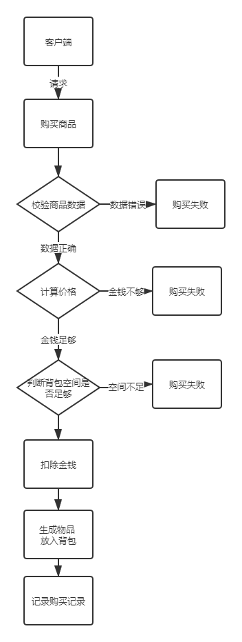
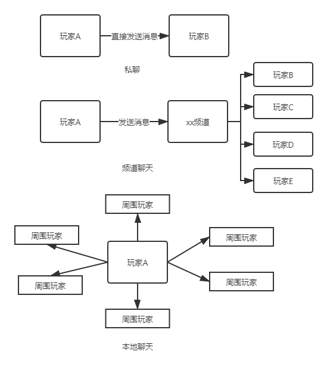

## 工作汇报
本周基本上都在开发第三阶段的项目需求，主要工作在开发商店模块、聊天模块
邮件模块、pk。  
### 周一：商店模块  
需求：  
商店的需求比较简单 主要有以下三点  
1.浏览商品  
2.购买商品  
3.出售物品    

浏览商品:  
商品的数据来自配置表 通过读取配置表中的数据来展示商品列表  

购买商品:  
其流程图如下所示：  
   

### 周二：聊天模块
需求：  
1.私聊频道    
2.全服频道    

在聊天模块中，我将私聊模块分为三种，分别是私聊、频道聊天和本地聊天。   
     
私聊：就是单个用户之间的聊天，这种聊天可以不建立聊天频道，直接根据目标Id找到用户发送消息即可。当然，如果需要，也可以建立聊天频道。   
 
频道聊天：频道聊天相当与一个用户组，频道有很多中，可以有：世界频道，队伍频道，阵营频道，帮派频道，工会频道等等。其实质就是一个用户  
组。在该模块中，聊天模块会监听用户登录消息，然后将用户加入到对应的频道中去。    

本地聊天：本地聊天指的是向周围可见的玩家发送消息，也就是视野范围内的玩家，不过目前由于只有场景，而没有地图，所以目前是向场景内的所有
玩家发送消息。
其图如下所示:  
  

### 周三:邮件模块  
需求：    
1.接收邮件  
2.发送邮件  
3.提取附件  
4.删除邮件  

### 周四pk：  

## 收获

## 工作进度
商店模块 聊天模块 邮件模块 PK模块 均已经接近完成 副本模块以及  
职业特色将在周六日完成。 